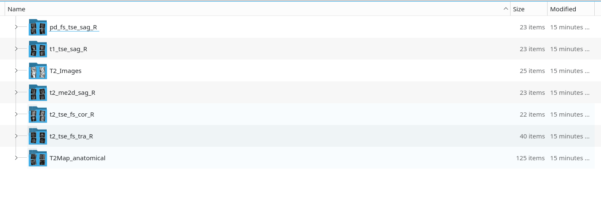

# DicomToPng
convert dicom images to png, and then dump into sequence directory

## Background

[好大夫][1] supports uploading compressed DICOM electronic films, but on the [健康160][2] platform, only mobile phone photos are possible, posing clarity issues. Moreover, the [健康160][2] platform only allows uploading a maximum of 8 images. Previously, my attempts to consult a specific chief physician online at [好大夫][1] were unsuccessful, despite the observation that this physician typically accepts consultations on the [健康160][2] platform. 

Therefore, the plan is to convert DICOM files to PNG in batches, concatenate them into sets of 8 arranged in grids, and upload them to [健康160][2] for remote consultations. 

Currently, there hasn't been success finding a batch conversion tool that meets these requirements; spent half the night yesterday implementing batch PNG conversion using Python, with plans to support concatenation next.

## Usage
```bash
pip install -r requirements.txt
python dicom_to_png.py
```

output as below:

<div style="text-align: center;">



</div>

## TODO
- [ ] Support concatenating and saving images as multiple individual images in a row * 8 grid arrangement.

[1]: https://www.haodf.com/	"好大夫"
[2]: https://www.96110.com/ "健康160"